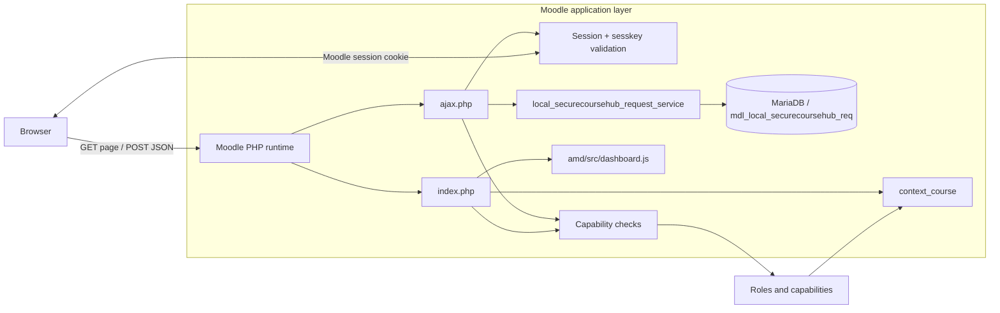

# Secure Course Hub Overview

## Short Description and Implemented User Stories

Secure Course Hub is a Moodle local plugin that lets users create and manage course help requests inside a course context. It uses Moodle authentication, sessions, courses, contexts, capabilities, and the Moodle database API rather than a separate login system.

Implemented user stories visible in the code:

- As an authenticated student, I can open the Secure Course Hub page for a course and see my own help requests.
- As an authenticated student, I can create a new help request for the current course.
- As a teacher or course manager, I can view all requests in the current course.
- As a teacher or course manager, I can filter course requests by status.
- As a teacher or manager, I can update the status of a request.
- As a site manager, I can manage requests across all courses.

Partially wired but not fully implemented server-side:

- The client code includes a delete action for open student requests, and the service class includes delete logic, but `ajax.php` does not expose a `delete_request` action handler.

## Local Environment and Moodle Version

The local environment is Docker-based:

- Web server and PHP: `php:8.3-apache` from [`Dockerfile.moodle`](Dockerfile.moodle)
- Database: `mariadb:10.11` from [`docker-compose.yml`](docker-compose.yml)
- Moodle URL: `http://127.0.0.1:8080`
- Moodle database connection: MariaDB database `moodle` with user `moodleuser`

The Moodle core tree in this workspace identifies itself as Moodle LMS 5.2 in [`moodle/composer.json`](moodle/composer.json). The plugin also declares a Moodle requirement build of `2024100700` in [`securecoursehub/version.php`](securecoursehub/version.php), which matches that core family.

## Architecture Diagram

Flow summary:

- The browser loads the plugin page through Moodle.
- `index.php` requires the Moodle course context and checks capabilities before rendering.
- `dashboard.js` sends JSON requests to `ajax.php`.
- `ajax.php` requires login, validates `sesskey`, checks capability rules, and calls the request service.
- `request_service.php` performs database reads and writes through Moodle’s DML API.
- Data persists in MariaDB in the custom request table.

## Plugin File Structure and Major File Purposes

- [`securecoursehub/version.php`](securecoursehub/version.php): plugin metadata, version, Moodle requirement, and release maturity.
- [`securecoursehub/index.php`](securecoursehub/index.php): course-scoped page controller and initial UI renderer.
- [`securecoursehub/ajax.php`](securecoursehub/ajax.php): JSON endpoint for create, read, and status-update actions.
- [`securecoursehub/classes/local/request_service.php`](securecoursehub/classes/local/request_service.php): database service layer for request CRUD-style operations.
- [`securecoursehub/db/access.php`](securecoursehub/db/access.php): capability definitions and role defaults.
- [`securecoursehub/db/install.xml`](securecoursehub/db/install.xml): custom table schema.
- [`securecoursehub/db/services.php`](securecoursehub/db/services.php): currently empty.
- [`securecoursehub/amd/src/dashboard.js`](securecoursehub/amd/src/dashboard.js): client-side request rendering and fetch calls.
- [`securecoursehub/lang/en/local_securecoursehub.php`](securecoursehub/lang/en/local_securecoursehub.php): language strings.
- [`securecoursehub/styles.css`](securecoursehub/styles.css): plugin styling.

## Data Model

The plugin stores its data in one custom table: `local_securecoursehub_req`.

### Table Purpose

This table stores course help requests, the user who created them, their current status, and any staff response.

### Columns

| Column | Type | Purpose |
| --- | --- | --- |
| `id` | int | Primary key |
| `courseid` | int | Owning Moodle course |
| `userid` | int | Request owner, linked to Moodle `user.id` |
| `title` | char(80) in schema | Short request title |
| `description` | text | Detailed request text |
| `status` | char(20) | Request state, default `open` |
| `response` | text | Optional staff reply |
| `timecreated` | int | Creation timestamp |
| `timemodified` | int | Last update timestamp |

### Keys and Indexes

- Primary key: `id`
- Foreign key: `courseid` references `course.id`
- Foreign key: `userid` references `user.id`
- Indexes: `courseid`, `userid`, and `status`

### Data Rules

- New requests start with status `open`.
- Allowed status values in the service layer are `open`, `inprogress`, and `resolved`.
- Request ownership is stored in `userid` and is always taken from the authenticated Moodle user on create.

## Authentication and Session Workflow

### Page Request

1. The browser loads [`index.php`](securecoursehub/index.php).
2. The plugin reads `courseid` from the request.
3. Moodle resolves the course and runs `require_login($course)`.
4. The page gets the course context with `context_course::instance($courseid)`.
5. The page checks the current user’s permissions with `require_capability()` and `has_capability()`.
6. Moodle renders the page and exposes `M.cfg.sesskey` to the AMD client.

### AJAX Request

1. The browser posts JSON to [`ajax.php`](securecoursehub/ajax.php).
2. `ajax.php` calls `require_login()` immediately.
3. It parses the JSON body and rejects malformed payloads.
4. It validates the Moodle sesskey with `confirm_sesskey()`.
5. It re-checks the course context and relevant capabilities.
6. It uses `$USER->id` from Moodle’s authenticated session rather than trusting any browser-supplied userid.
7. The request service reads or writes the database record.

### Session Behavior

- The browser only stores the Moodle session cookie.
- The authenticated user identity is kept in Moodle’s server-side session state.
- If the cookie or server session expires, the next request is treated as anonymous and `require_login()` redirects to login.

## Roles, Capabilities, Contexts, and Access-Control Matrix

The plugin uses two context levels:

- `CONTEXT_COURSE` for course-scoped viewing, request creation, and course request management.
- `CONTEXT_SYSTEM` for site-wide management.

Defined capabilities from [`db/access.php`](securecoursehub/db/access.php):

- `local/securecoursehub:viewown` in course context
- `local/securecoursehub:createrequest` in course context
- `local/securecoursehub:managecourserequests` in course context
- `local/securecoursehub:manageall` in system context

| Role | Context | View own requests | Create request | View all course requests | Update course requests | Manage all requests |
| --- | --- | --- | --- | --- | --- | --- |
| Student | Course | Yes | Yes | No | No | No |
| Teacher | Course | Yes | Yes | Yes | Yes | No |
| Editing teacher | Course | Yes | Yes | Yes | Yes | No |
| Manager | Course + System | Yes | Yes | Yes | Yes | Yes |

Operational rules enforced in code:

- Students can read only their own records for the current course.
- Creation always stores the authenticated Moodle user id.
- Teachers and managers can read course-wide requests.
- Teachers and managers can update request status.
- Site managers can manage requests across the site through the system capability.

## Notes

- The UI and service layer also contain helpers for student-side update/delete behavior, but the public AJAX controller currently exposes create, read, and status-update actions only.
- The document reflects the implementation present in this workspace rather than a generic Moodle plugin template.